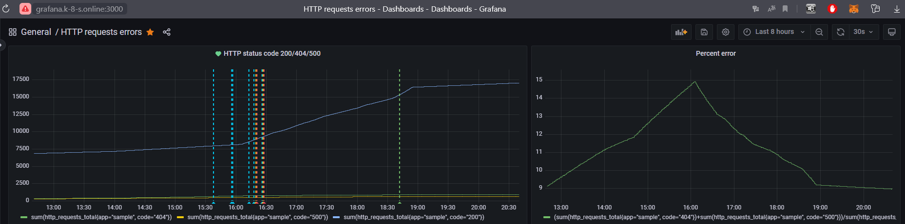

# k8s-yc-ingress-app-prometeus-grafana
Для работы с консолью Yandex Cloud была использована виртуальная машина с Ubuntu 20.04 LTS
## Получаем ID аккаунта Yandex
//yandex access_token https://oauth.yandex.ru/authorize?response_type=token&client_id

## Cоздаём папку и загружаем бинарник yc
sudo mkdir /yandex-cloud && cd /yandex-cloud
sudo wget https://storage.yandexcloud.net/yandexcloud-yc/release/0.98.0/linux/amd64/yc
```bash
sudo su
chmod +x yc
```
## Добавляем переменную в PATH и перелогиниваемся
```bash
echo "export PATH=$PATH:/yandex-cloud/" >> /etc/bash.bashrc
exit && exit
ssh user@10.1.0.53
```
## Авторизуемся
```bash
yc init
```
## Имя папки, зона
'k8s' (id = b1g5nhj3q723vaufpftp)
'ru-central1-a'

# Создаём сервисный аккаунт editor и с ролями container-registry.images.puller, editor, k8s.clusters.agent, k8s.tunnelClusters.agent, vpc.publicAdmin
```bash
yc vpc subnet create --name k8s-subnet-ru-central1-a --description "cluster-service-ipv4-range for k8s ru-central1-a" --folder-id b1g5nhj3q723vaufpftp --network-id enpnjn3egccs5t5b4360 --zone ru-central1-a --range 10.1.0.0/16
```
Результат:
```bash
id: e9buh9udirkfoiigvkpp
folder_id: b1g5nhj3q723vaufpftp
created_at: "2022-11-17T13:14:29Z"
name: k8s-subnet-ru-central1-a
description: cluster-service-ipv4-range for k8s ru-central1-a
network_id: enpnjn3egccs5t5b4360
zone_id: ru-central1-a
v4_cidr_blocks:
  - 10.1.0.0/16
```
## [Создаём ключи шифрования секретов](https://cloud.yandex.ru/docs/managed-kubernetes/concepts/encryption)
```bash
yc kms symmetric-key create --name k8s-key --default-algorithm aes-256
```
Результат:
```bash
id: abjm24dk96j4o710s62k
folder_id: b1g5nhj3q723vaufpftp
created_at: "2022-11-17T10:59:48Z"
name: k8s-key
status: ACTIVE
primary_version:
  id: abj8rqbe0ecvqupr0ivo
  key_id: abjm24dk96j4o710s62k
  status: ACTIVE
  algorithm: AES_256
  created_at: "2022-11-17T10:59:48Z"
  primary: true
default_algorithm: AES_256
```
## [Создадим группу безопасности](https://cloud.yandex.ru/docs/managed-kubernetes/operations/connect/security-groups)
enpulafljfmjr4r42kmh

## [Создаём кластер](https://cloud.yandex.ru/docs/managed-kubernetes/operations/kubernetes-cluster/kubernetes-cluster-create)
```bash
yc managed-kubernetes cluster create --name test-k8s --network-name default --zone ru-central1-a --subnet-name k8s-subnet-ru-central1-a --public-ip --release-channel regular --version 1.22 --cluster-ipv4-range 10.2.0.0/16 --service-ipv4-range 10.3.0.0/16 --security-group-ids enpulafljfmjr4r42kmh --service-account-id aje38lkeehft8pf0r2fq --node-service-account-id aje38lkeehft8pf0r2fq --kms-key-id abjm24dk96j4o710s62k
```
Результат:
done (8m23s)
```bash
id: catru28d6f5d3du138u3
folder_id: b1g5nhj3q723vaufpftp
created_at: "2022-11-18T09:01:25Z"
name: test-k8s
status: RUNNING
health: HEALTHY
network_id: enpnjn3egccs5t5b4360
master:
  zonal_master:
    zone_id: ru-central1-a
    internal_v4_address: 10.1.0.14
    external_v4_address: 158.160.40.111
  version: "1.22"
  endpoints:
    internal_v4_endpoint: https://10.1.0.14
    external_v4_endpoint: https://158.160.40.111
  master_auth:
    cluster_ca_certificate: |
      -----BEGIN CERTIFICATE-----
      MIIC5zCCAc+gAwIBAgIBADANBgkqhkiG9w0BAQsFADAVMRMwEQYDVQQDEwprdWJl
      cm5ldGVzMB4XDTIyMTExODA5MDEyNloXDTMyMTExNTA5MDEyNlowFTETMBEGA1UE
      AxMKa3ViZXJuZXRlczCCASIwDQYJKoZIhvcNAQEBBQADggEPADCCAQoCggEBAJfn
      EyTJky+nPB2NySNV+WllPJ6bFx4I7cPog1yaTQxKJ8iWCJA0N2iUVVpkSbrq7ldE
      x2ItdCqcBnEakrPkAIg7MvuLuHahRhmPV7e5Fj1n9DmCpdxf2MRrFmX1PxdYVbMv
      Awev9OIAlponxnQo9XblC5uPLZumETmqF+1EMk3lhCJGQckEtnsitsvrmPSmNeOK
      fcPCVUhXFzKouYN3Oh6KCUgryLQ9LRh+wyPL+7WUNnu1s5nGH9P3u/wMhsBL44wz
      rwqABan1Gxnym+GCTzKZyxqaIF/TW4NBKslbsr3VW8Y+QFYfEafixXHV6ZmNXGzT
      vBfnU1Exd20B5KzknG8CAwEAAaNCMEAwDgYDVR0PAQH/BAQDAgKkMA8GA1UdEwEB
      /wQFMAMBAf8wHQYDVR0OBBYEFEQSWEwLjNlPoaOmCCYkMh/50VY3MA0GCSqGSIb3
      DQEBCwUAA4IBAQAAltc5A2+hdZ3lvnrYffk+V1kCwUWXVTsPmDXA7GUUXJf7rtat
      U2Osm5NhylW4aJuPnY/lU5SmmoFuBspTHMT4QqA6+In/Gq9z4sjcHBRvZjTJig4l
      WH968vcsY2XrEaQ+VIB93cil9xw78QmyZvKbGbiLyPr3gbAdj1j16k3jwHhC6CCR
      KP/Lv/bhaGe/m/B+yOHvvrLt+dTRMWRnmrZfethg81KMVBaNl0muAQmQ1O1sGM2z
      Hj3Cn+WiLYlvGhusvDSB++lBSOhHFIEFSnGOPPZS4XM5JWqOQGU3d05jkvkpbo+b
      APyJ7zrDOcZyuTQTE1B55klCaHyg1LAG0nun
      -----END CERTIFICATE-----
  version_info:
    current_version: "1.22"
  maintenance_policy:
    auto_upgrade: true
    maintenance_window:
      anytime: {}
  security_group_ids:
    - enpulafljfmjr4r42kmh
ip_allocation_policy:
  cluster_ipv4_cidr_block: 10.2.0.0/16
  node_ipv4_cidr_mask_size: "24"
  service_ipv4_cidr_block: 10.3.0.0/16
service_account_id: aje38lkeehft8pf0r2fq
node_service_account_id: aje38lkeehft8pf0r2fq
release_channel: REGULAR
kms_provider:
  key_id: abjm24dk96j4o710s62k
log_group_id: ckg7kgphjvdmclid8tcc
```
## [Создание группы узлов](https://cloud.yandex.ru/docs/managed-kubernetes/operations/node-group/node-group-create)
```bash
yc managed-kubernetes node-group create --cluster-name test-k8s --cores 2 --core-fraction 20 --anytime-maintenance-window --disk-size 93 --disk-type network-ssd-nonreplicated --fixed-size 1 --memory 4 --name test-k8s-node --network-acceleration-type standard --network-interface security-group-ids=enpulafljfmjr4r42kmh,subnets=k8s-subnet-ru-central1-a,ipv4-address=nat --platform-id standard-v3 --container-runtime docker --preemptible --version 1.22
```
Результат:
done (3m45s)
```bash
id: catv12h7jvmbd3c6aa4p
cluster_id: catru28d6f5d3du138u3
created_at: "2022-11-18T12:40:34Z"
name: test-k8s-node
status: RUNNING
node_template:
  platform_id: standard-v3
  resources_spec:
    memory: "4294967296"
    cores: "2"
    core_fraction: "20"
  boot_disk_spec:
    disk_type_id: network-ssd-nonreplicated
    disk_size: "99857989632"
  v4_address_spec:
    one_to_one_nat_spec:
      ip_version: IPV4
  scheduling_policy:
    preemptible: true
  network_interface_specs:
    - subnet_ids:
        - e9buh9udirkfoiigvkpp
      primary_v4_address_spec:
        one_to_one_nat_spec:
          ip_version: IPV4
      security_group_ids:
        - enpulafljfmjr4r42kmh
  network_settings:
    type: STANDARD
  container_runtime_settings:
    type: DOCKER
scale_policy:
  fixed_scale:
    size: "1"
allocation_policy:
  locations:
    - zone_id: ru-central1-a
      subnet_id: e9buh9udirkfoiigvkpp
deploy_policy:
  max_expansion: "3"
instance_group_id: cl1prq0vi1874kfk4mfb
node_version: "1.22"
version_info:
  current_version: "1.22"
maintenance_policy:
  auto_upgrade: true
  auto_repair: true
  maintenance_window:
    anytime: {}
```
## [Установка Ingress-контроллера NGINX](https://cloud.yandex.ru/docs/managed-kubernetes/tutorials/ingress-cert-manager)
```bash
sudo snap install helm --classic
helm repo update
helm repo add ingress-nginx https://kubernetes.github.io/ingress-nginx
```
## Установите NGINX Ingress Controller
```bash
helm install ingress-nginx ingress-nginx/ingress-nginx
```
Результат:
```bash
NAME: ingress-nginx
LAST DEPLOYED: Fri Nov 18 05:35:09 2022
NAMESPACE: default
STATUS: deployed
REVISION: 1
TEST SUITE: None
NOTES:
The ingress-nginx controller has been installed.
It may take a few minutes for the LoadBalancer IP to be available.
You can watch the status by running 'kubectl --namespace default get services -o wide -w ingress-nginx-controller'

An example Ingress that makes use of the controller:
  apiVersion: networking.k8s.io/v1
  kind: Ingress
  metadata:
    name: example
    namespace: foo
  spec:
    ingressClassName: nginx
    rules:
      - host: www.example.com
        http:
          paths:
            - pathType: Prefix
              backend:
                service:
                  name: exampleService
                  port:
                    number: 80
              path: /
    # This section is only required if TLS is to be enabled for the Ingress
    tls:
      - hosts:
        - www.example.com
        secretName: example-tls

If TLS is enabled for the Ingress, a Secret containing the certificate and key must also be provided:

  apiVersion: v1
  kind: Secret
  metadata:
    name: example-tls
    namespace: foo
  data:
    tls.crt: <base64 encoded cert>
    tls.key: <base64 encoded key>
  type: kubernetes.io/tls
```
## Установите менеджер сертификатов
```bash
kubectl apply -f https://github.com/jetstack/cert-manager/releases/download/v1.9.2/cert-manager.yaml
```
Результат:
```bash
namespace/cert-manager unchanged
customresourcedefinition.apiextensions.k8s.io/certificaterequests.cert-manager.io configured
customresourcedefinition.apiextensions.k8s.io/certificates.cert-manager.io configured
customresourcedefinition.apiextensions.k8s.io/challenges.acme.cert-manager.io configured
customresourcedefinition.apiextensions.k8s.io/clusterissuers.cert-manager.io configured
customresourcedefinition.apiextensions.k8s.io/issuers.cert-manager.io configured
customresourcedefinition.apiextensions.k8s.io/orders.acme.cert-manager.io configured
serviceaccount/cert-manager-cainjector configured
serviceaccount/cert-manager configured
serviceaccount/cert-manager-webhook configured
configmap/cert-manager-webhook created
clusterrole.rbac.authorization.k8s.io/cert-manager-cainjector configured
clusterrole.rbac.authorization.k8s.io/cert-manager-controller-issuers configured
clusterrole.rbac.authorization.k8s.io/cert-manager-controller-clusterissuers configured
clusterrole.rbac.authorization.k8s.io/cert-manager-controller-certificates configured
clusterrole.rbac.authorization.k8s.io/cert-manager-controller-orders configured
clusterrole.rbac.authorization.k8s.io/cert-manager-controller-challenges configured
clusterrole.rbac.authorization.k8s.io/cert-manager-controller-ingress-shim configured
clusterrole.rbac.authorization.k8s.io/cert-manager-view configured
clusterrole.rbac.authorization.k8s.io/cert-manager-edit configured
clusterrole.rbac.authorization.k8s.io/cert-manager-controller-approve:cert-manager-io configured
clusterrole.rbac.authorization.k8s.io/cert-manager-controller-certificatesigningrequests configured
clusterrole.rbac.authorization.k8s.io/cert-manager-webhook:subjectaccessreviews configured
clusterrolebinding.rbac.authorization.k8s.io/cert-manager-cainjector configured
clusterrolebinding.rbac.authorization.k8s.io/cert-manager-controller-issuers configured
clusterrolebinding.rbac.authorization.k8s.io/cert-manager-controller-clusterissuers configured
clusterrolebinding.rbac.authorization.k8s.io/cert-manager-controller-certificates configured
clusterrolebinding.rbac.authorization.k8s.io/cert-manager-controller-orders configured
clusterrolebinding.rbac.authorization.k8s.io/cert-manager-controller-challenges configured
clusterrolebinding.rbac.authorization.k8s.io/cert-manager-controller-ingress-shim configured
clusterrolebinding.rbac.authorization.k8s.io/cert-manager-controller-approve:cert-manager-io configured
clusterrolebinding.rbac.authorization.k8s.io/cert-manager-controller-certificatesigningrequests configured
clusterrolebinding.rbac.authorization.k8s.io/cert-manager-webhook:subjectaccessreviews configured
role.rbac.authorization.k8s.io/cert-manager-cainjector:leaderelection configured
role.rbac.authorization.k8s.io/cert-manager:leaderelection configured
role.rbac.authorization.k8s.io/cert-manager-webhook:dynamic-serving configured
rolebinding.rbac.authorization.k8s.io/cert-manager-cainjector:leaderelection configured
rolebinding.rbac.authorization.k8s.io/cert-manager:leaderelection configured
rolebinding.rbac.authorization.k8s.io/cert-manager-webhook:dynamic-serving configured
service/cert-manager configured
service/cert-manager-webhook configured
deployment.apps/cert-manager-cainjector configured
deployment.apps/cert-manager configured
deployment.apps/cert-manager-webhook configured
mutatingwebhookconfiguration.admissionregistration.k8s.io/cert-manager-webhook configured
validatingwebhookconfiguration.admissionregistration.k8s.io/cert-manager-webhook configured
```
## Убедитесь, что в пространстве имен cert-manager создано три пода с готовностью 1/1 и статусом Running
```bash
kubectl get pods -n cert-manager --watch
```
Результат:
```bash
NAME                                      READY    STATUS    RESTARTS   AGE
cert-manager-6d64556cf4-4txnl              1/1     Running   0          2m49s
cert-manager-cainjector-557c8fc6df-m6njr   1/1     Running   0          2m49s
cert-manager-webhook-6d4cbbc7d8-r9wnq      1/1     Running   0          2m49s
```
## Создайте объекты
Чтобы протестировать работу менеджера сертификатов, необходимо создать объекты ClusterIssuer, Ingress, Service и Deployment.
Создайте YAML-файл acme-issuer.yaml с манифестом объекта ClusterIssuer:
```bash
nano acme-issuer.yaml
```
```yaml
apiVersion: cert-manager.io/v1
kind: ClusterIssuer
metadata:
  name: letsencrypt
  namespace: cert-manager
spec:
  acme:
    server: https://acme-v02.api.letsencrypt.org/directory
    email: delux-1990@hotmail.com
    privateKeySecretRef:
      name: letsencrypt
    solvers:
    - http01:
        ingress:
          class: nginx
```
#В итоге удалил тестовый NGINX Ingress Controller
---------------------
## Устанавливаю тестовое приложение по заданию
```bash
kubectl apply -f deployment.yaml
```
Состав:
```yaml
apiVersion: apps/v1
kind: Deployment
metadata:
  annotations:
  labels:
    app: sample
  name: sample
spec:
  replicas: 10
  selector:
    matchLabels:
      app: sample
  template:
    metadata:
      annotations:
        prometheus.io.scheme: http
        prometheus.io/path: /metrics
        prometheus.io/port: "8080"
        prometheus.io/scrape: "true"
      labels:
        app: sample
    spec:
      containers:
      - image: quay.io/brancz/prometheus-example-app:v0.5.0
        imagePullPolicy: IfNotPresent
        name: sample
        ports:
        - containerPort: 8080
```
## Устанавливаю сервис
```bash
kubectl apply -f services.yaml
```
Состав:
```yaml
apiVersion: v1
kind: Service
metadata:
  annotations:
  name: sample
spec:
  ports:
  - port: 8080
    targetPort: 8080
  selector:
    app: sample
  type: LoadBalancer
```
## Узнаём IP адрес приложения
```bash
kubectl get svc
```
Результат:
```bash
NAME                                 TYPE           CLUSTER-IP      EXTERNAL-IP      PORT(S)                      AGE
app                                  ClusterIP      10.96.161.236   <none>           80/TCP                       41m
cm-acme-http-solver-n2vp7            NodePort       10.96.162.100   <none>           8089:30145/TCP               23m
ingress-nginx-controller             LoadBalancer   10.96.146.208   158.160.43.235   80:30276/TCP,443:31995/TCP   25m
ingress-nginx-controller-admission   ClusterIP      10.96.147.155   <none>           443/TCP                      25m
kubernetes                           ClusterIP      10.96.128.1     <none>           443/TCP                      2d
sample                               LoadBalancer   10.96.214.106   51.250.1.64      8080:32465/TCP               3m1s
```
Выполняем запрос к приложению по внешнему IP
```bash
curl http://51.250.1.64:8080
```
Результат:
```bash
Hello from example application.
```

## Добавляем Ingress к приложению nano ingress.yaml
```bash
kubectl apply -f ingress.yaml
```
Состав:
```yaml
---
apiVersion: networking.k8s.io/v1
kind: Ingress
metadata:
  name: alb-demo-tls
  annotations:
    ingress.alb.yc.io/subnets: e9bebg7ld18fks2o7fsp e9bckvm6os5jgf2alo44 e9bc6p8lcq8jbgev0u3q
    ingress.alb.yc.io/security-groups: enp4kqe0c8af1v4mehe3
    ingress.alb.yc.io/external-ipv4-address: auto
    ingress.alb.yc.io/group-name: sample
spec:
  tls:
    - hosts:
        - k-8-s.online
      secretName: yc-certmgr-cert-id-fpqlr5jl2nof5sjjp668
  rules:
    - host: k-8-s.online
      http:
        paths:
          - pathType: Prefix
            path: "/"
            backend:
              service:
                name: sample
                port:
                  name: http
---
apiVersion: v1
kind: Service
metadata:
  name: sample
spec:  
  ports:
  - nodePort: 32465
    port: 8080
    protocol: TCP
    targetPort: 8080
  selector:
    app: sample
  type: LoadBalancer
status:
  loadBalancer:
    ingress:
    - ip: 51.250.1.64
```
## Установите Prometheus 
## Добавьте репозиторий, содержащий дистрибутив Prometheus:
```bash
helm repo add prometheus-community https://prometheus-community.github.io/helm-charts && \
helm repo update
```
Результат:
```bash
"prometheus-community" has been added to your repositories
Hang tight while we grab the latest from your chart repositories...
...Successfully got an update from the "ingress-nginx" chart repository
...Successfully got an update from the "prometheus-community" chart repository
Update Complete. ⎈Happy Helming!⎈
```
## Установите Prometheus:
```bash
helm install my-prom prometheus-community/prometheus
```
Результат:
```bash
NAME: my-prom
LAST DEPLOYED: Mon Nov 21 10:09:01 2022
NAMESPACE: default
STATUS: deployed
REVISION: 1
TEST SUITE: None
NOTES:
The Prometheus server can be accessed via port 80 on the following DNS name from within your cluster:
my-prom-prometheus-server.default.svc.cluster.local


Get the Prometheus server URL by running these commands in the same shell:
  export POD_NAME=$(kubectl get pods --namespace default -l "app=prometheus,component=server" -o jsonpath="{.items[0].metadata.name}")
  kubectl --namespace default port-forward $POD_NAME 9090


The Prometheus alertmanager can be accessed via port 80 on the following DNS name from within your cluster:
my-prom-prometheus-alertmanager.default.svc.cluster.local


Get the Alertmanager URL by running these commands in the same shell:
  export POD_NAME=$(kubectl get pods --namespace default -l "app=prometheus,component=alertmanager" -o jsonpath="{.items[0].metadata.name}")
  kubectl --namespace default port-forward $POD_NAME 9093
#################################################################################
######   WARNING: Pod Security Policy has been disabled by default since    #####
######            it deprecated after k8s 1.25+. use                        #####
######            .Values.prometheus-node-exporter.rbac.pspEnabled with     #####
######            .Values.prometheus-node-exporter.rbac.pspAnnotations      #####
######            in case you still need it.                                #####
#################################################################################


The Prometheus PushGateway can be accessed via port 9091 on the following DNS name from within your cluster:
my-prom-prometheus-pushgateway.default.svc.cluster.local


Get the PushGateway URL by running these commands in the same shell:
  export POD_NAME=$(kubectl get pods --namespace default -l "app=prometheus,component=pushgateway" -o jsonpath="{.items[0].metadata.name}")
  kubectl --namespace default port-forward $POD_NAME 9091

For more information on running Prometheus, visit:
https://prometheus.io/
```
## Убедитесь, что все поды перешли в состояние Running:
```bash
kubectl get pods -l "app=prometheus"
```
Результат:
```bash
NAME                                               READY   STATUS    RESTARTS   AGE
my-prom-prometheus-alertmanager-5448789c56-j9bnr   2/2     Running   0          78s
my-prom-prometheus-pushgateway-5456dfd5d7-pjhfw    1/1     Running   0          78s
my-prom-prometheus-server-6bb944b74f-ljfjb         2/2     Running   0          78s
```
## Установите кеширующий прокси trickster
Кеширующий прокси trickster ускоряет чтение из базы данных Prometheus, что позволяет отображать метрики Grafana практически в реальном времени, а также снизить нагрузку на Prometheus.

## Добавьте репозиторий, содержащий дистрибутив trickster:
```bash
helm repo add tricksterproxy https://helm.tricksterproxy.io && \
helm repo update
```
## Создайте конфигурационный файл trickster.yaml, содержащий настройки trickster:
```yaml
frontend:
  listenAddress: ""
  tlsListenAddress: ""
  tlsListenPort: ""
  connectionsLimit: "0"
origins:
  - name: default
    originType: prometheus
    originURL: http://my-prom-prometheus-server:80
profiler:
  enabled: false
  port: 6060
prometheusScrape: false
prometheus:
  serviceMonitor:
    enabled: false
    interval: 30s
    labels: {}
replicaCount: 1
image:
  repository: tricksterproxy/trickster
  tag: "1.1"
  pullPolicy: IfNotPresent
service:
  annotations: {}
  labels: {}
  clusterIP: ""
  externalIPs: []
  loadBalancerIP: ""
  loadBalancerSourceRanges: []
  metricsPort: 8481
  servicePort: 8480
  type: ClusterIP
ingress:
  enabled: false
  annotations: {}
  extraLabels: {}
  hosts: []
  tls: []
volumes:
  persistent:
    type: "persistentVolume"
    enabled: false
    mountPath: "/tmp/trickster"
    accessModes:
      - ReadWriteOnce
    annotations: {}
    existingClaim: ""
    size: 15Gi
  generic:
    type: "generic"
    enabled: true
    mountPath: "/tmp/trickster"
podAnnotations: {}
resources: {}
securityContext: {}
```
## Установите trickster:
```bash
helm install trickster tricksterproxy/trickster --namespace default -f trickster.yaml
```
Результат:
```bash
NAME: trickster
LAST DEPLOYED: Mon Nov 21 10:14:28 2022
NAMESPACE: default
STATUS: deployed
REVISION: 1
TEST SUITE: None
NOTES:
Trickster can be accessed via port 8480 on the following DNS name from within your cluster:
trickster.default.svc.cluster.local


Get the trickster URL by running these commands in the same shell:
  export POD_NAME=$(kubectl get pods --namespace default -l "app=trickster,component=trickster" -o jsonpath="{.items[0].metadata.name}")
  kubectl --namespace default port-forward $POD_NAME 9090
```  
## Убедитесь, что под trickster перешел в состояние Running:
```bash
kubectl get pods -l "app=trickster"
```
Результат:
```bash
NAME                         READY   STATUS    RESTARTS   AGE
trickster-86bdf6bc4d-lzlv8   1/1     Running   0          52s
```
## Установите Grafana
При развертывании приложения будут созданы:
Deployment приложения Grafana.
PersistentVolumeClaim для резервирования внутреннего хранилища.
Service типа LoadBalancer для организации сетевого доступа к консоли управления Grafana.
Чтобы установить Grafana:
Создайте конфигурационный файл grafana.yaml
```yaml
---
apiVersion: v1
kind: PersistentVolumeClaim
metadata:
  name: grafana-pvc
spec:
  accessModes:
    - ReadWriteOnce
  resources:
    requests:
      storage: 1Gi
---
apiVersion: apps/v1
kind: Deployment
metadata:
  labels:
    app: grafana
  name: grafana
spec:
  selector:
    matchLabels:
      app: grafana
  template:
    metadata:
      labels:
        app: grafana
    spec:
      securityContext:
        fsGroup: 472
        supplementalGroups:
          - 0
      containers:
        - name: grafana
          image: grafana/grafana:latest
          imagePullPolicy: IfNotPresent
          ports:
            - containerPort: 3000
              name: http-grafana
              protocol: TCP
          readinessProbe:
            failureThreshold: 3
            httpGet:
              path: /robots.txt
              port: 3000
              scheme: HTTP
            initialDelaySeconds: 10
            periodSeconds: 30
            successThreshold: 1
            timeoutSeconds: 2
          livenessProbe:
            failureThreshold: 3
            initialDelaySeconds: 30
            periodSeconds: 10
            successThreshold: 1
            tcpSocket:
              port: 3000
            timeoutSeconds: 1
          resources:
            requests:
              cpu: 250m
              memory: 750Mi
          volumeMounts:
            - mountPath: /var/lib/grafana
              name: grafana-pv
      volumes:
        - name: grafana-pv
          persistentVolumeClaim:
            claimName: grafana-pvc
---
apiVersion: v1
kind: Service
metadata:
  name: grafana
spec:
  ports:
    - port: 3000
      protocol: TCP
      targetPort: http-grafana
  selector:
    app: grafana
  sessionAffinity: None
  type: LoadBalancer
```
При необходимости измените:
Размер хранилища, отведенного для работы Grafana, в параметре spec.resources.requests.storage для kind: PersistentVolumeClaim.
Вычислительные ресурсы, выделяемые поду Grafana, в параметрах spec.containers.resources для kind: Deployment.

## Установите Grafana:
```bash
kubectl apply -f grafana.yaml
```
Результат:
```bash
persistentvolumeclaim/grafana-pvc created
deployment.apps/grafana created
service/grafana created
```
## Убедитесь, что под Grafana перешел в состояние Running:
```bash
kubectl get pods -l "app=grafana"
```
Результат:
```bash
NAME                       READY   STATUS    RESTARTS   AGE
grafana-566494879c-xq75c   1/1     Running   0          2m49s
```
## Настройте и проверьте работу Grafana
Узнайте адрес, на котором доступен сервис Grafana, и перейдите по этому адресу:
```bash
export GRAFANA_IP=$(kubectl get service/grafana -o jsonpath='{.status.loadBalancer.ingress[0].ip}') && \
export GRAFANA_PORT=$(kubectl get service/grafana -o jsonpath='{.spec.ports[0].port}') && \
echo http://$GRAFANA_IP:$GRAFANA_PORT
```
Результат:
```bash
http://158.160.40.117:3000
```
## Добавьте источник данных с типом Prometheus и следующими настройками:
Name — Prometheus.
URL — http://trickster:8480.
Нажмите кнопку Save & test и убедитесь, что источник данных успешно подключен (Data source is working).
Импортируйте дашборд Kubernetes Deployment Statefulset Daemonset metrics, содержащий основные метрики Kubernetes. Укажите идентификатор дашборда (8588) при импорте.
Откройте дашборд и убедитесь, что Grafana получает метрики от кластера Managed Service for Kubernetes.

## Генерируем запросы к веб app
```bash
while true; do curl http://k-8-s.online:8080/internal-err -i; sleep 10; done
```
```bash
while true; do curl http://k-8-s.online:8080/err -i; sleep 10; done
```
```bash
while true; do curl http://k-8-s.online:8080/ -i; sleep 1; done
```
## Создаём дашборд для Grafana с алертом по заданию
http://grafana.k-8-s.online:3000/

Конфиг:
```yaml
{
  "annotations": {
    "list": [
      {
        "builtIn": 1,
        "datasource": {
          "type": "grafana",
          "uid": "-- Grafana --"
        },
        "enable": true,
        "hide": true,
        "iconColor": "rgba(0, 211, 255, 1)",
        "name": "Annotations & Alerts",
        "target": {
          "limit": 100,
          "matchAny": false,
          "tags": [],
          "type": "dashboard"
        },
        "type": "dashboard"
      }
    ]
  },
  "editable": true,
  "fiscalYearStartMonth": 0,
  "graphTooltip": 0,
  "id": 2,
  "links": [],
  "liveNow": false,
  "panels": [
    {
      "datasource": {
        "type": "prometheus",
        "uid": "I3RhPAO4z"
      },
      "description": "",
      "fieldConfig": {
        "defaults": {
          "color": {
            "mode": "palette-classic"
          },
          "custom": {
            "axisCenteredZero": false,
            "axisColorMode": "text",
            "axisLabel": "",
            "axisPlacement": "auto",
            "barAlignment": 0,
            "drawStyle": "line",
            "fillOpacity": 0,
            "gradientMode": "none",
            "hideFrom": {
              "legend": false,
              "tooltip": false,
              "viz": false
            },
            "lineInterpolation": "linear",
            "lineWidth": 1,
            "pointSize": 5,
            "scaleDistribution": {
              "type": "linear"
            },
            "showPoints": "auto",
            "spanNulls": false,
            "stacking": {
              "group": "A",
              "mode": "none"
            },
            "thresholdsStyle": {
              "mode": "off"
            }
          },
          "mappings": [],
          "thresholds": {
            "mode": "absolute",
            "steps": [
              {
                "color": "green",
                "value": null
              },
              {
                "color": "red",
                "value": 80
              }
            ]
          }
        },
        "overrides": []
      },
      "gridPos": {
        "h": 10,
        "w": 14,
        "x": 0,
        "y": 0
      },
      "id": 2,
      "options": {
        "legend": {
          "calcs": [],
          "displayMode": "list",
          "placement": "bottom",
          "showLegend": true
        },
        "tooltip": {
          "mode": "single",
          "sort": "none"
        }
      },
      "targets": [
        {
          "datasource": {
            "type": "prometheus",
            "uid": "I3RhPAO4z"
          },
          "editorMode": "builder",
          "expr": "sum(http_requests_total{app=\"sample\", code=\"404\"})",
          "hide": false,
          "legendFormat": "__auto",
          "range": true,
          "refId": "404"
        },
        {
          "datasource": {
            "type": "prometheus",
            "uid": "I3RhPAO4z"
          },
          "editorMode": "builder",
          "expr": "sum(http_requests_total{app=\"sample\", code=\"500\"})",
          "hide": false,
          "legendFormat": "__auto",
          "range": true,
          "refId": "500"
        },
        {
          "datasource": {
            "type": "prometheus",
            "uid": "I3RhPAO4z"
          },
          "editorMode": "builder",
          "expr": "sum(http_requests_total{app=\"sample\", code=\"200\"})",
          "hide": false,
          "legendFormat": "__auto",
          "range": true,
          "refId": "200"
        }
      ],
      "title": "HTTP status code 200/404/500",
      "type": "timeseries"
    },
    {
      "datasource": {
        "type": "prometheus",
        "uid": "I3RhPAO4z"
      },
      "fieldConfig": {
        "defaults": {
          "color": {
            "mode": "palette-classic"
          },
          "custom": {
            "axisCenteredZero": false,
            "axisColorMode": "text",
            "axisLabel": "",
            "axisPlacement": "auto",
            "barAlignment": 0,
            "drawStyle": "line",
            "fillOpacity": 0,
            "gradientMode": "none",
            "hideFrom": {
              "legend": false,
              "tooltip": false,
              "viz": false
            },
            "lineInterpolation": "smooth",
            "lineWidth": 1,
            "pointSize": 5,
            "scaleDistribution": {
              "type": "linear"
            },
            "showPoints": "auto",
            "spanNulls": false,
            "stacking": {
              "group": "A",
              "mode": "none"
            },
            "thresholdsStyle": {
              "mode": "off"
            }
          },
          "mappings": [],
          "thresholds": {
            "mode": "absolute",
            "steps": [
              {
                "color": "green",
                "value": null
              },
              {
                "color": "red",
                "value": 80
              }
            ]
          }
        },
        "overrides": []
      },
      "gridPos": {
        "h": 10,
        "w": 10,
        "x": 14,
        "y": 0
      },
      "id": 4,
      "options": {
        "legend": {
          "calcs": [],
          "displayMode": "list",
          "placement": "bottom",
          "showLegend": true
        },
        "tooltip": {
          "mode": "single",
          "sort": "none"
        }
      },
      "targets": [
        {
          "datasource": {
            "type": "prometheus",
            "uid": "I3RhPAO4z"
          },
          "editorMode": "code",
          "expr": "(sum(http_requests_total{app=\"sample\", code=\"404\"})+sum(http_requests_total{app=\"sample\", code=\"500\"}))/sum(http_requests_total{app=\"sample\", code=\"200\"})*100 ",
          "legendFormat": "__auto",
          "range": true,
          "refId": "Error"
        }
      ],
      "title": "Percent error",
      "type": "timeseries"
    }
  ],
  "refresh": "30s",
  "schemaVersion": 37,
  "style": "dark",
  "tags": [],
  "templating": {
    "list": []
  },
  "time": {
    "from": "now-8h",
    "to": "now"
  },
  "timepicker": {},
  "timezone": "",
  "title": "HTTP requests errors",
  "uid": "jPvhipO4k",
  "version": 11,
  "weekStart": ""
}
```
Результат:


## Ссылка на бота в Телеграмм для алертов
https://t.me/+oQCouEmNmvU5MGJi


